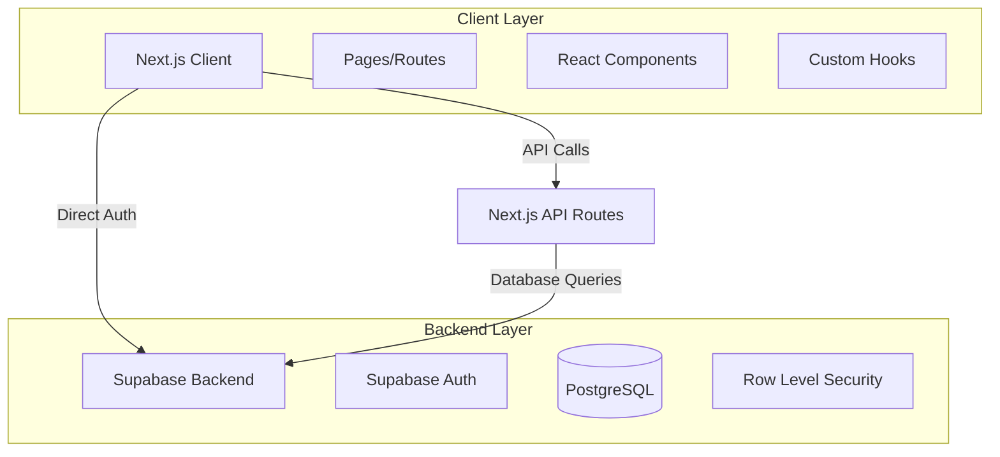
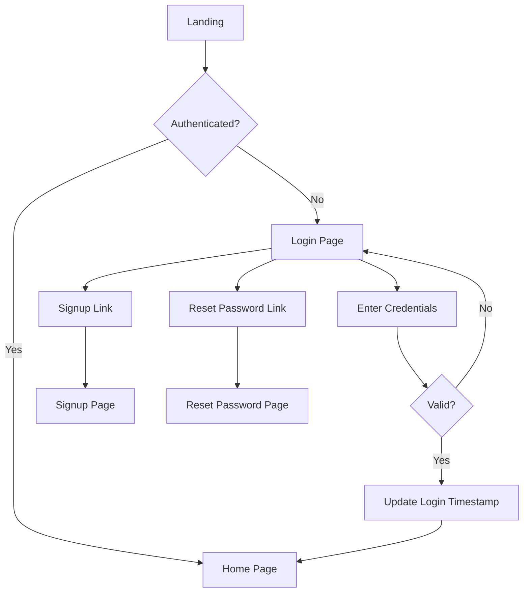
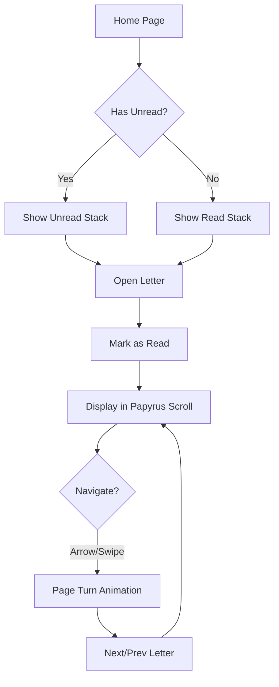
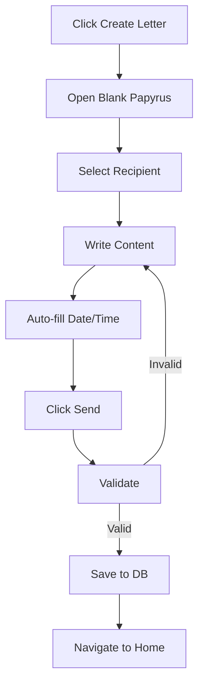
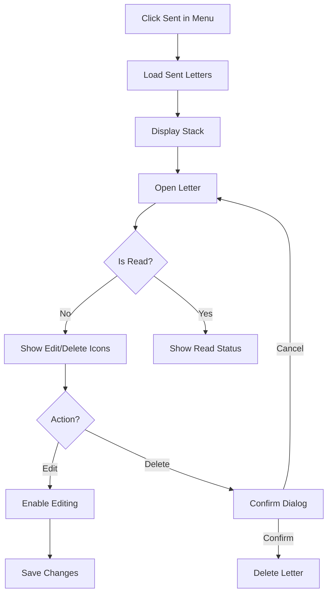

# Design Document

## Overview

The Letters is a responsive web application built with Next.js 14 (App Router), React, TypeScript, and Supabase. The application provides an immersive papyrus-themed interface for exchanging letters between users with features including authentication, letter composition, contact management, and advanced filtering. The design emphasizes visual authenticity with papyrus styling throughout and smooth page-turning animations.

### Technology Stack

- **Frontend Framework**: Next.js 14 with App Router
- **UI Library**: React 18 with TypeScript
- **Styling**: Tailwind CSS with custom papyrus theme
- **Backend/Database**: Supabase (PostgreSQL with Row Level Security)
- **Authentication**: Supabase Auth
- **State Management**: React Context API + React Query for server state
- **Animations**: Framer Motion for page-turning effects
- **Date Handling**: date-fns

## Architecture

### High-Level Architecture




### Application Structure

```
src/
├── app/
│   ├── (auth)/
│   │   ├── login/
│   │   ├── signup/
│   │   └── reset-password/
│   ├── (main)/
│   │   ├── layout.tsx          # Main layout with title bar
│   │   ├── page.tsx             # Home page (letter inbox)
│   │   ├── sent/
│   │   ├── compose/
│   │   └── contacts/
│   └── api/
│       └── letters/
├── components/
│   ├── auth/
│   ├── letters/
│   │   ├── PapyrusScroll.tsx
│   │   ├── LetterStack.tsx
│   │   └── LetterNavigation.tsx
│   ├── ui/
│   │   ├── PapyrusButton.tsx
│   │   ├── PapyrusInput.tsx
│   │   ├── PapyrusDatePicker.tsx
│   │   └── PapyrusSelect.tsx
│   └── layout/
│       ├── TitleBar.tsx
│       └── ProfileMenu.tsx
├── lib/
│   ├── supabase/
│   │   ├── client.ts
│   │   ├── server.ts
│   │   └── middleware.ts
│   ├── hooks/
│   └── utils/
└── styles/
    └── papyrus-theme.css
```


## Components and Interfaces

### Core Components

#### 1. PapyrusScroll Component

The main component for displaying and editing letters with papyrus styling.

**Props:**
```typescript
interface PapyrusScrollProps {
  letter?: Letter;
  mode: 'view' | 'edit' | 'compose';
  onSave?: (content: string, recipientId: string) => Promise<void>;
  onEdit?: (content: string) => Promise<void>;
  onDelete?: () => Promise<void>;
  showActions?: boolean;
}
```

**Features:**
- Papyrus texture background with aged paper appearance
- Editable/non-editable content area
- Auto-populated date/time in compose mode
- Edit and delete icons for unseen sent letters
- Responsive layout adapting to screen size

#### 2. LetterStack Component

Displays letters in a stacked papyrus layout.

**Props:**
```typescript
interface LetterStackProps {
  letters: Letter[];
  type: 'inbox' | 'sent';
  onLetterSelect: (letterId: string) => void;
  currentIndex: number;
}
```

**Features:**
- Visual stacking effect with 3D perspective
- Unread count badge for inbox
- Read/unread status indicators
- Recipient read status for sent letters


#### 3. LetterNavigation Component

Handles navigation between letters with arrow buttons and horizontal scrolling.

**Props:**
```typescript
interface LetterNavigationProps {
  currentIndex: number;
  totalLetters: number;
  onNavigate: (direction: 'prev' | 'next') => void;
  letters: Letter[];
}
```

**Features:**
- Left/right arrow buttons with papyrus styling
- Horizontal scroll/swipe gesture detection
- Page-turning animation integration
- Disabled state for boundary conditions

#### 4. FilterPanel Component

Provides filtering controls for letters.

**Props:**
```typescript
interface FilterPanelProps {
  contacts: Contact[];
  onFilterChange: (filters: LetterFilters) => void;
  currentFilters: LetterFilters;
}
```

**Features:**
- Multi-select contact dropdown with papyrus styling
- Date range pickers (before/after) with papyrus theme
- Clear filters button
- Real-time filter application


#### 5. TitleBar Component

Main navigation bar with actions and profile menu.

**Props:**
```typescript
interface TitleBarProps {
  user: User;
  onLogout: () => void;
}
```

**Features:**
- App title/logo with papyrus styling
- "Create New Letter" button
- "Add Contact" button
- Profile icon with dropdown menu (Sent, Logout)

#### 6. Papyrus UI Components

Custom themed components for consistent styling:

- **PapyrusButton**: Button with aged paper texture and hover effects
- **PapyrusInput**: Text input with papyrus border and background
- **PapyrusDatePicker**: Date picker with papyrus calendar styling
- **PapyrusSelect**: Dropdown with papyrus menu styling
- **PapyrusDialog**: Modal/confirmation dialog with papyrus theme


## Data Models

### Database Schema

#### users Table (Managed by Supabase Auth)

```sql
-- Extended with custom fields
CREATE TABLE user_profiles (
  id UUID PRIMARY KEY REFERENCES auth.users(id),
  last_login_at TIMESTAMPTZ,
  created_at TIMESTAMPTZ DEFAULT NOW(),
  updated_at TIMESTAMPTZ DEFAULT NOW()
);
```

#### letters Table

```sql
CREATE TABLE letters (
  id UUID PRIMARY KEY DEFAULT uuid_generate_v4(),
  author_id UUID NOT NULL REFERENCES auth.users(id),
  recipient_id UUID NOT NULL REFERENCES auth.users(id),
  content TEXT NOT NULL,
  created_at TIMESTAMPTZ DEFAULT NOW(),
  updated_at TIMESTAMPTZ DEFAULT NOW(),
  is_read BOOLEAN DEFAULT FALSE,
  read_at TIMESTAMPTZ,
  
  CONSTRAINT different_users CHECK (author_id != recipient_id)
);

CREATE INDEX idx_letters_recipient ON letters(recipient_id, created_at);
CREATE INDEX idx_letters_author ON letters(author_id, created_at);
CREATE INDEX idx_letters_read_status ON letters(recipient_id, is_read, created_at);
```


#### contacts Table

```sql
CREATE TABLE contacts (
  id UUID PRIMARY KEY DEFAULT uuid_generate_v4(),
  user_id UUID NOT NULL REFERENCES auth.users(id),
  contact_user_id UUID NOT NULL REFERENCES auth.users(id),
  display_name TEXT NOT NULL,
  created_at TIMESTAMPTZ DEFAULT NOW(),
  
  UNIQUE(user_id, contact_user_id),
  CONSTRAINT different_users CHECK (user_id != contact_user_id)
);

CREATE INDEX idx_contacts_user ON contacts(user_id);
```

### TypeScript Interfaces

```typescript
interface User {
  id: string;
  email: string;
  lastLoginAt: Date | null;
}

interface Letter {
  id: string;
  authorId: string;
  recipientId: string;
  content: string;
  createdAt: Date;
  updatedAt: Date;
  isRead: boolean;
  readAt: Date | null;
  author?: User;
  recipient?: User;
}

interface Contact {
  id: string;
  userId: string;
  contactUserId: string;
  displayName: string;
  createdAt: Date;
  user?: User;
}

interface LetterFilters {
  contactIds: string[];
  beforeDate: Date | null;
  afterDate: Date | null;
}
```


## Row Level Security Policies

### letters Table Policies

```sql
-- Enable RLS
ALTER TABLE letters ENABLE ROW LEVEL SECURITY;

-- Read policy: Users can read letters they authored or received
CREATE POLICY "Users can read their own letters"
  ON letters FOR SELECT
  USING (auth.uid() = author_id OR auth.uid() = recipient_id);

-- Insert policy: Users can create letters as author
CREATE POLICY "Users can create letters"
  ON letters FOR INSERT
  WITH CHECK (auth.uid() = author_id);

-- Update policy: Recipients can mark as read
CREATE POLICY "Recipients can mark letters as read"
  ON letters FOR UPDATE
  USING (auth.uid() = recipient_id)
  WITH CHECK (auth.uid() = recipient_id);

-- Update policy: Authors can edit unread letters
CREATE POLICY "Authors can edit unread letters"
  ON letters FOR UPDATE
  USING (auth.uid() = author_id AND is_read = FALSE)
  WITH CHECK (auth.uid() = author_id AND is_read = FALSE);

-- Delete policy: Authors can delete unread letters
CREATE POLICY "Authors can delete unread letters"
  ON letters FOR DELETE
  USING (auth.uid() = author_id AND is_read = FALSE);
```


### contacts Table Policies

```sql
-- Enable RLS
ALTER TABLE contacts ENABLE ROW LEVEL SECURITY;

-- Users can read their own contacts
CREATE POLICY "Users can read their own contacts"
  ON contacts FOR SELECT
  USING (auth.uid() = user_id);

-- Users can create their own contacts
CREATE POLICY "Users can create contacts"
  ON contacts FOR INSERT
  WITH CHECK (auth.uid() = user_id);

-- Users can delete their own contacts
CREATE POLICY "Users can delete their own contacts"
  ON contacts FOR DELETE
  USING (auth.uid() = user_id);
```

### user_profiles Table Policies

```sql
-- Enable RLS
ALTER TABLE user_profiles ENABLE ROW LEVEL SECURITY;

-- Users can read their own profile
CREATE POLICY "Users can read own profile"
  ON user_profiles FOR SELECT
  USING (auth.uid() = id);

-- Users can update their own profile
CREATE POLICY "Users can update own profile"
  ON user_profiles FOR UPDATE
  USING (auth.uid() = id)
  WITH CHECK (auth.uid() = id);
```


## API Design

### Custom Hooks

#### useLetters Hook

```typescript
function useLetters(filters?: LetterFilters) {
  // Fetches letters with filtering
  // Returns: { letters, isLoading, error, refetch }
}
```

#### useSentLetters Hook

```typescript
function useSentLetters(filters?: LetterFilters) {
  // Fetches sent letters with recipient read status
  // Returns: { letters, isLoading, error, refetch }
}
```

#### useContacts Hook

```typescript
function useContacts() {
  // Fetches user's contacts
  // Returns: { contacts, isLoading, error, addContact, deleteContact }
}
```

#### useLetterNavigation Hook

```typescript
function useLetterNavigation(letters: Letter[], initialIndex: number) {
  // Manages letter navigation state and gestures
  // Returns: { currentIndex, goNext, goPrev, canGoNext, canGoPrev, handleSwipe }
}
```


### Supabase Queries

#### Fetch Inbox Letters

```typescript
async function fetchInboxLetters(userId: string, filters: LetterFilters) {
  let query = supabase
    .from('letters')
    .select(`
      *,
      author:author_id(id, email),
      recipient:recipient_id(id, email)
    `)
    .eq('recipient_id', userId)
    .order('is_read', { ascending: true })
    .order('created_at', { ascending: false });

  // Apply filters
  if (filters.contactIds.length > 0) {
    query = query.in('author_id', filters.contactIds);
  }
  if (filters.beforeDate) {
    query = query.lt('created_at', filters.beforeDate.toISOString());
  }
  if (filters.afterDate) {
    query = query.gt('created_at', filters.afterDate.toISOString());
  }

  return query;
}
```

#### Fetch Sent Letters

```typescript
async function fetchSentLetters(userId: string, filters: LetterFilters) {
  let query = supabase
    .from('letters')
    .select(`
      *,
      recipient:recipient_id(id, email, last_login_at)
    `)
    .eq('author_id', userId)
    .order('created_at', { ascending: false });

  // Apply filters similar to inbox
  return query;
}
```


#### Mark Letter as Read

```typescript
async function markLetterAsRead(letterId: string) {
  return supabase
    .from('letters')
    .update({
      is_read: true,
      read_at: new Date().toISOString()
    })
    .eq('id', letterId);
}
```

#### Update Login Timestamp

```typescript
async function updateLoginTimestamp(userId: string) {
  return supabase
    .from('user_profiles')
    .upsert({
      id: userId,
      last_login_at: new Date().toISOString(),
      updated_at: new Date().toISOString()
    });
}
```


## Papyrus Theme Design

### Visual Design System

#### Color Palette

```css
:root {
  --papyrus-bg: #f4e8d0;
  --papyrus-dark: #d4c4a8;
  --papyrus-darker: #b8a888;
  --papyrus-text: #3d2f1f;
  --papyrus-text-light: #6b5d4f;
  --papyrus-border: #c4b49a;
  --papyrus-shadow: rgba(61, 47, 31, 0.2);
  --papyrus-accent: #8b7355;
}
```

#### Typography

- **Primary Font**: 'Cinzel' or 'Crimson Text' for headings (serif, classical)
- **Body Font**: 'Lora' or 'Merriweather' for content (readable serif)
- **Handwriting Font**: 'Caveat' or 'Dancing Script' for letter content

#### Textures and Effects

- **Paper Texture**: SVG or CSS background with noise/grain effect
- **Torn Edges**: Irregular borders using clip-path or SVG masks
- **Shadows**: Soft, warm shadows to create depth
- **Aging Effects**: Subtle brown/sepia overlays and stains


### Animation Design

#### Page-Turning Animation

Using Framer Motion for smooth transitions:

```typescript
const pageTurnVariants = {
  enter: (direction: number) => ({
    rotateY: direction > 0 ? 90 : -90,
    opacity: 0,
    scale: 0.8
  }),
  center: {
    rotateY: 0,
    opacity: 1,
    scale: 1
  },
  exit: (direction: number) => ({
    rotateY: direction > 0 ? -90 : 90,
    opacity: 0,
    scale: 0.8
  })
};

const transition = {
  duration: 0.6,
  ease: [0.43, 0.13, 0.23, 0.96]
};
```

#### Stacking Animation

Letters in stack should have:
- Slight rotation variance (±2-3 degrees)
- Offset positioning (5-10px increments)
- Scale reduction for lower items (0.98, 0.96, 0.94)
- Shadow depth increasing with stack position


## User Flows

### Authentication Flow



### Letter Reading Flow




### Letter Composition Flow



### Sent Letter Management Flow




## Error Handling

### Error Categories

1. **Authentication Errors**
   - Invalid credentials
   - Email already exists
   - Password reset failures
   - Session expiration

2. **Database Errors**
   - Connection failures
   - Query timeouts
   - RLS policy violations
   - Constraint violations

3. **Validation Errors**
   - Invalid user ID for contacts
   - Empty letter content
   - Invalid date ranges
   - Missing required fields

4. **Network Errors**
   - Offline state
   - Request timeouts
   - Server unavailable

### Error Handling Strategy

#### User-Facing Errors

Display errors in papyrus-themed toast notifications or inline messages:

```typescript
interface ErrorDisplay {
  type: 'error' | 'warning' | 'info';
  message: string;
  action?: {
    label: string;
    onClick: () => void;
  };
}
```


#### Error Recovery

- **Retry Logic**: Automatic retry for transient network errors (max 3 attempts)
- **Optimistic Updates**: Update UI immediately, rollback on failure
- **Offline Support**: Queue actions when offline, sync when online
- **Graceful Degradation**: Show cached data when real-time updates fail

#### Error Logging

```typescript
interface ErrorLog {
  timestamp: Date;
  userId?: string;
  errorType: string;
  message: string;
  stack?: string;
  context: Record<string, any>;
}
```

Log errors to console in development, send to monitoring service in production.


## Testing Strategy

### Unit Testing

**Tools**: Jest + React Testing Library

**Coverage Areas**:
- Custom hooks (useLetters, useContacts, useLetterNavigation)
- Utility functions (date formatting, filtering logic)
- Component logic (form validation, state management)

**Example Test**:
```typescript
describe('useLetterNavigation', () => {
  it('should navigate to next letter when available', () => {
    const { result } = renderHook(() => 
      useLetterNavigation(mockLetters, 0)
    );
    
    act(() => {
      result.current.goNext();
    });
    
    expect(result.current.currentIndex).toBe(1);
  });
});
```

### Integration Testing

**Tools**: Playwright or Cypress

**Coverage Areas**:
- Authentication flows (login, signup, password reset)
- Letter CRUD operations
- Contact management
- Filtering functionality
- Navigation and animations


### Component Testing

**Focus**: Visual and interaction testing of papyrus-themed components

```typescript
describe('PapyrusScroll', () => {
  it('should display edit and delete icons for unread sent letters', () => {
    render(
      <PapyrusScroll 
        letter={mockUnreadSentLetter} 
        mode="view" 
        showActions={true}
      />
    );
    
    expect(screen.getByLabelText('Edit letter')).toBeInTheDocument();
    expect(screen.getByLabelText('Delete letter')).toBeInTheDocument();
  });
});
```

### E2E Testing

**Scenarios**:
1. Complete user journey: signup → add contact → compose letter → send → view sent
2. Recipient journey: login → view unread → navigate letters → mark as read
3. Filter and search: apply multiple filters → verify results
4. Edit/delete: compose → send → edit before read → delete before read

### Performance Testing

**Metrics**:
- Initial page load: < 2s
- Letter navigation animation: 60fps
- Filter application: < 500ms
- Database query response: < 1s


## Responsive Design

### Breakpoints

```css
/* Mobile */
@media (max-width: 767px) {
  /* Single column layout */
  /* Simplified navigation */
  /* Touch-optimized controls */
}

/* Tablet */
@media (min-width: 768px) and (max-width: 1023px) {
  /* Optimized for portrait/landscape */
  /* Larger touch targets */
}

/* Desktop */
@media (min-width: 1024px) {
  /* Full feature layout */
  /* Hover states */
  /* Keyboard shortcuts */
}
```

### Mobile Adaptations

- **Navigation**: Bottom navigation bar for primary actions
- **Filters**: Collapsible filter panel with drawer
- **Letter Stack**: Reduced stack depth (show 2-3 letters)
- **Papyrus Scroll**: Full-screen view with optimized font sizes
- **Gestures**: Enhanced swipe sensitivity for letter navigation

### Tablet Adaptations

- **Split View**: Optional side-by-side letter list and detail view
- **Filters**: Persistent filter sidebar
- **Touch Targets**: Minimum 44x44px for all interactive elements


## Performance Optimization

### Database Optimization

1. **Indexing**: Indexes on frequently queried columns (recipient_id, author_id, created_at, is_read)
2. **Query Optimization**: Use select() to fetch only needed fields
3. **Pagination**: Implement cursor-based pagination for large letter lists
4. **Caching**: Cache contact lists and user profiles

### Frontend Optimization

1. **Code Splitting**: Route-based code splitting with Next.js dynamic imports
2. **Image Optimization**: Use Next.js Image component for papyrus textures
3. **Lazy Loading**: Lazy load letters outside viewport
4. **Memoization**: Use React.memo for expensive components
5. **Virtual Scrolling**: For large letter lists (if needed)

### Asset Optimization

1. **Fonts**: Subset fonts to include only needed characters
2. **Textures**: Optimize papyrus texture images (WebP format)
3. **SVG**: Use SVG for icons and decorative elements
4. **CSS**: Extract critical CSS for above-the-fold content


## Security Considerations

### Authentication Security

1. **Password Requirements**: Minimum 8 characters, mix of letters and numbers
2. **Session Management**: Secure HTTP-only cookies for session tokens
3. **CSRF Protection**: Built-in Next.js CSRF protection
4. **Rate Limiting**: Limit login attempts (5 per 15 minutes)

### Data Security

1. **Row Level Security**: Enforce at database level (Supabase RLS)
2. **Input Validation**: Sanitize all user inputs
3. **XSS Prevention**: Use React's built-in XSS protection
4. **SQL Injection**: Use parameterized queries (Supabase client handles this)

### Privacy

1. **Email Privacy**: Don't expose emails in UI (use display names)
2. **User ID Validation**: Verify user exists before adding as contact
3. **Letter Privacy**: Ensure only author and recipient can access
4. **Audit Trail**: Log sensitive operations (letter deletion, account changes)


## Deployment Strategy

### Environment Configuration

```env
# .env.local
NEXT_PUBLIC_SUPABASE_URL=your-project-url
NEXT_PUBLIC_SUPABASE_ANON_KEY=your-anon-key
SUPABASE_SERVICE_ROLE_KEY=your-service-role-key
```

### Build Process

1. **Development**: `npm run dev` - Hot reload with fast refresh
2. **Production Build**: `npm run build` - Optimized production build
3. **Type Checking**: `npm run type-check` - TypeScript validation
4. **Linting**: `npm run lint` - ESLint checks

### Deployment Platforms

**Recommended**: Vercel (optimal for Next.js)
- Automatic deployments from Git
- Preview deployments for PRs
- Edge functions for API routes
- Built-in analytics

**Alternative**: Netlify, AWS Amplify, or self-hosted

### Database Migration

Use Supabase migrations for schema changes:

```bash
supabase migration new create_letters_table
supabase db push
```


## Future Enhancements

### Phase 2 Features (Post-MVP)

1. **Rich Text Editor**: Support for formatting, images in letters
2. **Letter Templates**: Pre-designed papyrus templates
3. **Attachments**: Ability to attach files to letters
4. **Notifications**: Email/push notifications for new letters
5. **Letter Collections**: Organize letters into folders/categories
6. **Search**: Full-text search across letter content
7. **Export**: Download letters as PDF with papyrus styling
8. **Themes**: Multiple papyrus styles (ancient, medieval, modern)
9. **Collaborative Letters**: Multiple authors on one letter
10. **Letter Scheduling**: Schedule letters to be sent at specific times

### Technical Debt Considerations

1. **Real-time Updates**: Implement Supabase real-time subscriptions
2. **Offline Mode**: Full offline support with sync
3. **Accessibility**: WCAG 2.1 AA compliance audit
4. **Internationalization**: Multi-language support
5. **Analytics**: User behavior tracking and insights


## Documentation

### README.md Structure

The project README should include:

1. **Project Overview**
   - Brief description of the Letters
   - Key features and capabilities
   - Visual appeal (papyrus theme)

2. **Features Section**
   - Authentication (login, signup, password reset)
   - Letter management (compose, send, read, edit, delete)
   - Contact management
   - Advanced filtering (contacts, date ranges)
   - Papyrus-themed UI
   - Page-turning animations
   - Responsive design

3. **Tech Stack**
   - Next.js 14, React 18, TypeScript
   - Tailwind CSS with custom papyrus theme
   - Supabase (database, authentication, RLS)
   - Framer Motion (animations)
   - date-fns (date handling)

4. **Prerequisites**
   - Node.js version requirement
   - npm/yarn
   - Supabase account

5. **Local Setup Instructions**
   - Clone repository
   - Install dependencies
   - Environment variables setup
   - Database schema setup (SQL scripts)
   - Run development server

6. **Usage Guide**
   - How to create an account
   - How to add contacts
   - How to compose and send letters
   - How to navigate letters
   - How to use filters
   - How to manage sent letters

7. **Available Scripts**
   - Development, build, start, lint, type-check commands

8. **Database Setup**
   - Include SQL migration scripts
   - RLS policy setup instructions
   - Initial data seeding (if applicable)

9. **Deployment**
   - Recommended platforms
   - Environment configuration
   - Build and deployment steps

10. **Contributing** (optional)
    - Guidelines for contributors

The README should be comprehensive enough for a new developer to set up and run the project independently.

